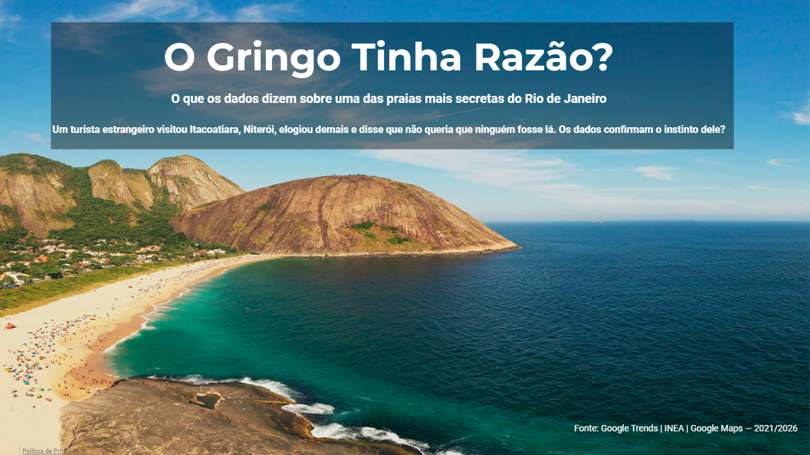

# 🏖️ O Gringo Tinha Razão?
### Uma análise de dados sobre a praia mais secreta do Rio de Janeiro

---

## 📖 Contexto

Um turista estrangeiro visitou a Praia de Itacoatiara, em Niterói (RJ), elogiou demais e disse que não queria que ninguém fosse lá — para que continuasse sendo boa.

Mas o que os dados dizem? Será que Itacoatiara é mesmo um segredo guardado a sete chaves?

---

## 🎯 Objetivo

Cruzar dados públicos de **popularidade**, **reputação** e **qualidade ambiental** para responder:

> *Itacoatiara é realmente a melhor praia do Rio — e ninguém sabe disso?*

---

## 📊 Dashboard

🔗 **[Acesse o dashboard completo no Looker Studio](https://datastudio.google.com/reporting/6b07cc6e-3c4d-4e94-88b2-ab68eac2491f)**



---

## 🔍 Fontes de Dados

| Fonte | Dados | Período |
|---|---|---|
| Google Trends | Interesse de busca comparativo | 2021–2026 |
| Google Maps | Notas e volume de avaliações | Mai/2026 |
| INEA/RJ | Balneabilidade das praias | 2013–2024 |

---

## 💡 Principais Insights

**1. Invisível no Google**
Itacoatiara tem score médio de **4** no Google Trends — 15x menor que Copacabana (64). A praia mais secreta do RJ é tão pouco buscada que "Praia de Itacoatiara Niterói" tem interesse zero.

**2. Melhor avaliada do RJ**
Com nota **4,8** no Google Maps, Itacoatiara supera Copacabana e Ipanema (4,7) e empata com Grumari — a praia mais preservada do Rio.

**3. Mais avaliações que todas**
Apesar de "secreta", tem **16.584 avaliações** — mais que Copacabana (9.337) e Ipanema (6.124) juntas. Quem vai, ama e avalia.

**4. Água mais limpa**
Segundo o INEA, Itacoatiara manteve **98% de água própria para banho** nos últimos 12 anos — nunca caiu abaixo de 95%.

**5. Sazonalidade única**
Enquanto Copacabana tem picos em janeiro (Réveillon) e maio (shows internacionais: Madonna, Shakira, Lady Gaga), Itacoatiara tem interesse **constante o ano inteiro** — sua audiência não depende de eventos.

---

## 🛠️ Tecnologias Utilizadas

- **Python** (Pandas) — coleta, limpeza e análise dos dados
- **Google Trends** — extração de dados de interesse de busca
- **Looker Studio** — visualização e dashboard interativo
- **Google Sheets** — armazenamento e conexão com Looker Studio
- **Photoshop** — tratamento das imagens do dashboard

---

## 📁 Estrutura do Projeto

```
o-gringo-tinha-razao/
├── data/
│   ├── time_series_google_trends.csv
│   ├── top_queries_google_trends.csv
│   ├── balneabilidade_comparativo_rj_niteroi.csv
│   └── reputacao_google_maps.csv
├── assets/
│   └── capa.png
├── itacoatiara_analise.py
└── README.md
```

---

## ▶️ Como Reproduzir

```bash
# Clone o repositório
git clone https://github.com/Magashi1556/o-gringo-tinha-razao.git

# Instale as dependências
pip install pandas matplotlib

# Execute a análise
python itacoatiara_analise.py
```

---

## ✅ Conclusão

Os dados confirmam o instinto do gringo. Itacoatiara é a praia mais bem avaliada, com água mais limpa e mais avaliações do Rio de Janeiro — e ainda assim quase ninguém a busca no Google.

**Talvez seja melhor assim.**

---

*Análise desenvolvida por **Erik Andrey** — 2026*

[](https://www.linkedin.com/in/erikandreydataa/)
